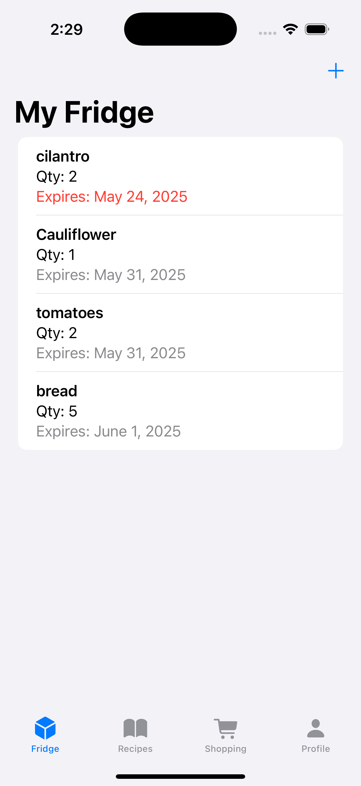
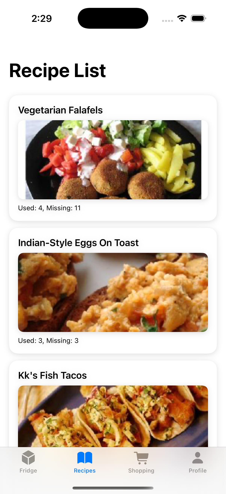
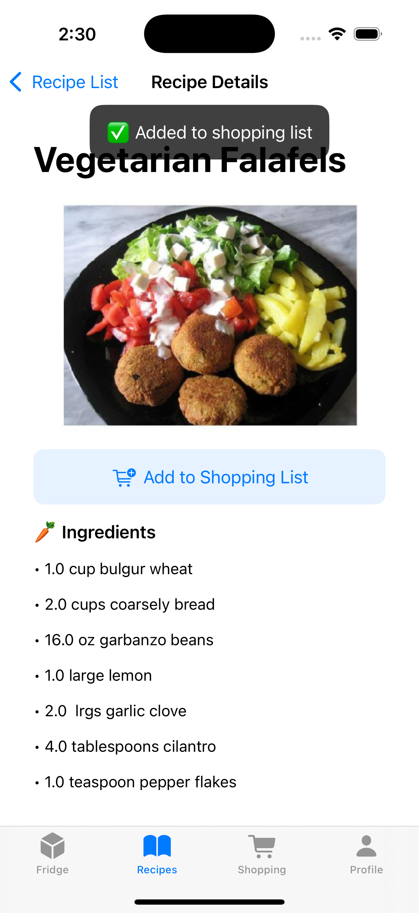
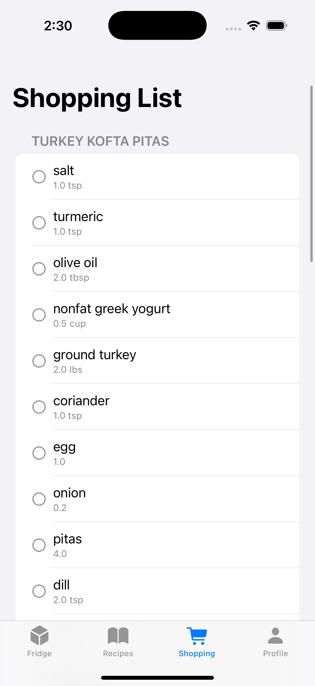
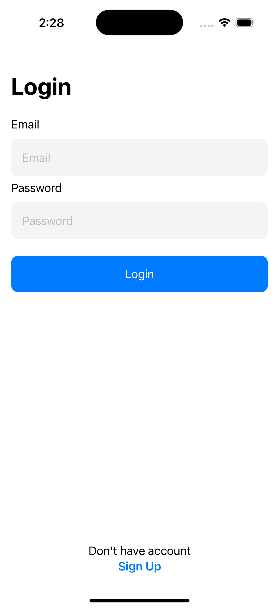

# 👨‍🍳 CookMate – Smart Recipe & Shopping Companion

**CookMate** is a modern iOS app built with SwiftUI and Firebase that helps users find delicious recipes and build personalized shopping lists — all in a seamless, beautifully designed interface.

---

## 🚀 Features

- 🔍 **Search Recipes** using Spoonacular API
- 📋 **View Detailed Recipes** with ingredients, instructions, and source link
- 🛒 **Add Ingredients to Shopping List** with 1 tap
- 🧾 **Smart Shopping List**:
  - Grouped by recipe
  - Supports checkmarks and delete
  - Syncs with Firestore
- 👤 **User Authentication** with Firebase Auth (Login/Register)
- 🌙 **Clean UI** using SwiftUI & MVVM architecture

---

## 🧠 Tech Stack

- `SwiftUI` + `MVVM`
- `Firebase Auth` + `Firestore`
- `Spoonacular API`
- `AsyncImage`, `.plist`-based API key management
- Secure secret handling via `.gitignore`

---


## 📸 Screenshots

| Home | Recipe List | Recipe Detail |
|------|-------------|----------------|
|  |  |  |

| Shopping List | Profile | Login | Signup |
|---------------|---------|-------|--------|
|  |  |  |  |


## 🔐 API Key Setup

To use this app:

1. Create a `Secrets.plist` file in the root directory
2. Add:
   ```xml
   <key>API_KEY</key>
   <string>your_api_key_here</string>
   ```

---

## 🛠 How to Run

1. Clone the repo  
2. Open `cookBook.xcodeproj` in Xcode  
3. Run on iOS Simulator (iOS 16 or above recommended)  
4. Make sure Firebase setup is configured in your project  

---

## 🙋🏻‍♂️ About the Developer

Built by [Urja 💙] — a passionate iOS and UX designer building elegant apps with real-world functionality.
